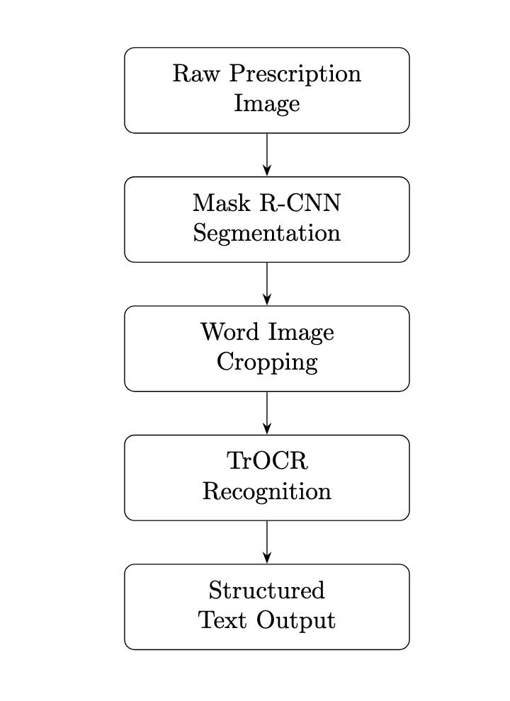

# Handwritten Medical Prescription Recognition (HMPR)


## 📌 Subject Area Description

Recognizing handwritten medical prescriptions is an exceptionally difficult problem. Physicians often write hastily and illegibly, using non-standard abbreviations. The scanned prescription images are further complicated by background lines, handwriting overlaps, paper distortions, and inconsistent formatting.

These challenges are exacerbated by:
- **High variability** in handwriting styles.
- **Overlapping characters and strokes**.
- **Noisy backgrounds** and scanning artifacts.
- **Specialized medical vocabulary**.

Effective recognition requires accurate **segmentation** and **robust OCR models** tailored to this complex visual-textual domain.


## 📌 Project Description

This project aims to automate the recognition of handwritten medical prescriptions. The system is built on a two-stage pipeline:

1. **Word segmentation** using a fine-tuned Mask R-CNN model.
2. **Text recognition** using a Transformer-based OCR model.


The main project materials include:
- `baseline.ipynb`: Combined segmentation + OCR pipeline.
- `Instance_Segmentation.ipynb` and `model_ocr.ipynb`: Standalone segmentation solution.
- `baseline_recognition.ipynb`: Standalone OCR baseline.

## Recognition steps



## Architecture

### Segmentation (Detectron2 + Mask R-CNN)
- Pretrained on COCO, fine-tuned for word detection (`text` vs `background`).
- Outputs polygon masks and bounding boxes.
- Trained model saved as: `segm-model_final.pth`.

📁 **Training data:**


📂 `train_segmentation/`  
├───  `images/`  
├───  `annotations.json`  
└───  `annotations_extended.json`  

---

### OCR (TrOCR: Vision Transformer + Transformer Decoder)
- Encoder: `google/vit-base-patch16-224-in21k` (ViT pretrained on ImageNet21k).
- Decoder: Lightweight Transformer with label smoothing.
- Trained model saved as: `ocr-model-last.ckpt`.

**Training data:**

📂 `train_recognition/`  
├───  `images/`  
└───  `labels.csv` 

---

### 🔹 Augmentation
Using **Albumentations** for robust training:
- Scaling, cropping, rotation, horizontal flip.
- Grid distortion, brightness/contrast adjustment.
- Adaptive resizing to 256×256.

---

### 🔹 Libraries & Tools
- `detectron2` for segmentation.
- `transformers` (Hugging Face) for OCR.
- `torch`, `albumentations`, `opencv-python`, `numpy`, `pandas`.

---

## 📊 Evaluation

The script `evaluate.py` computes recognition accuracy via **Character Error Rate (CER)**.

### 🔹 Matching polygons:
1. For each ground truth (GT) polygon, find the predicted polygon with **highest IoU** (must be > 0).
2. Match GT and predicted texts as **True Positive (TP)**.
3. If no match is found for a GT polygon → **False Negative (FN)** (predicted text = `""`).
4. If a predicted polygon has no GT match → **False Positive (FP)** (GT text = `""`).

### 🔹 Character Error Rate (CER):

CER = (Total Character Edit Distance) / (Total Reference Characters)

- **Total Character Edit Distance**: Sum of Levenshtein distances between predicted and true text for all matched words
- **Total Reference Characters**: Sum of character counts in all ground truth words

```math
\text{CER} = \frac{\sum_{i=1}^{n} \text{Levenshtein}(pred_i, true_i)}{\sum_{i=1}^{n} \text{len}(true_i)}
```

*Where:*
- `Levenshtein(pred_i, true_i)` = Edit distance at character level
- `len(true_i)` = Length of ground truth string
- Summation over all matched word pairs


- Computed at the **character level**, including spaces.
- Value ranges from `0` (perfect match) to `1+` (high error).
- **IoU threshold**: `IoU ≥ 0.5` defines a valid match.

---

## 🔗 Model Weights

Model checkpoints (`segm-model_final.pth` and `ocr-model-last.ckpt`) are generated after training and stored externally (e.g., Google Drive).

---


## Key Features

Medical terminology optimized recognition

Robust handling of noisy prescription images

Dual evaluation metrics (IoU for segmentation, CER for OCR)

Albumentations-powered image augmentation

End-to-end processing from image to structured text

